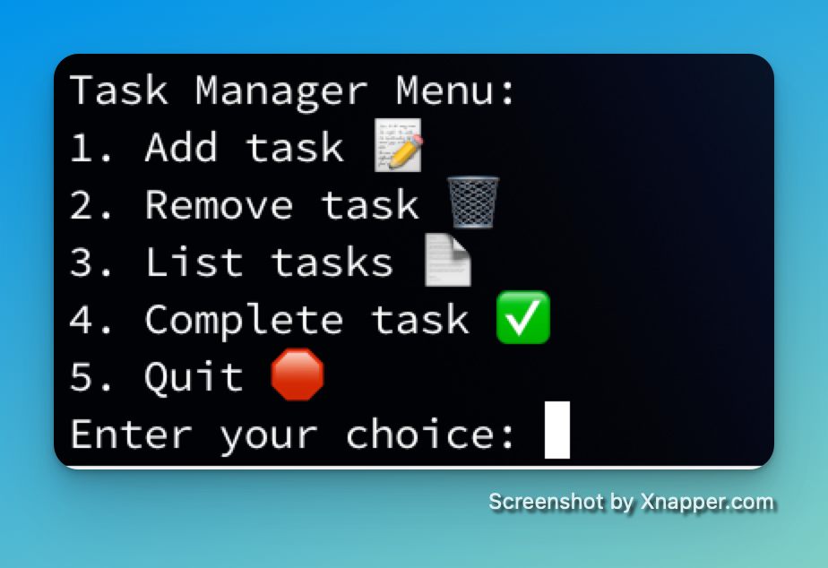

# TaskApp
Terminal based task management application.

I wanted to create a basic and light weight task management application that I could run agnostically whether at work or at home on personal machines that would be easy to use.

## How to Run
No packages needed outside of pickle and os.

1. run the command: python TaskApp.py
2. Menu will let you know how to add, remove, list, or delete a task
